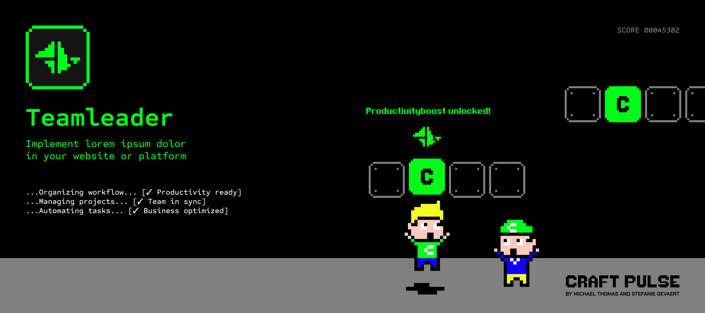

# Teamleader plugin for Craft CMS 5.x

The Teamleader plugin is a powerful tool for ...

## Requirements

This plugin requires Craft CMS 5.0.0 or later.

## Installation

To install Teamleader, follow these steps:

1. Open your terminal and go to your Craft project:

        cd /path/to/project

2. Then tell Composer to load the plugin:

        composer require craftpulse/craft-teamleader

3. Install the plugin via `craft install/plugin teamleader` via the CLI, or in the Control Panel, go to Settings → Plugins and click the “Install” button for Teamleader.

You can also install Teamleader via the **Plugin Store** in the Craft Control Panel.

Teamleader works on Craft 5.x.

## Formie integration
...

Brought to you by [CraftPulse](https://craft-pulse.com/)
